# LLM

→ Introduction

→ How LLM works?

→ How Transformer works ? 

---

A **Large Language Model (LLM)** is a type of computer program designed to understand and generate text that sounds like a human. It is "large" because it's trained on enormous amounts of text data, allowing it to learn patterns in language.

**Tesla**, **BYD**, and **Tata EV** are **different types of electric cars**

*Similarly,* 

**GPT** (by OpenAI) , **Grok** (by xAI) , **LLaMA** (by Meta), **DeepSeek** (by DeepSeek AI) , 
**Gemini** (by Google) are **different types of Large Language Models (LLMs)**

- *Reference*
    
    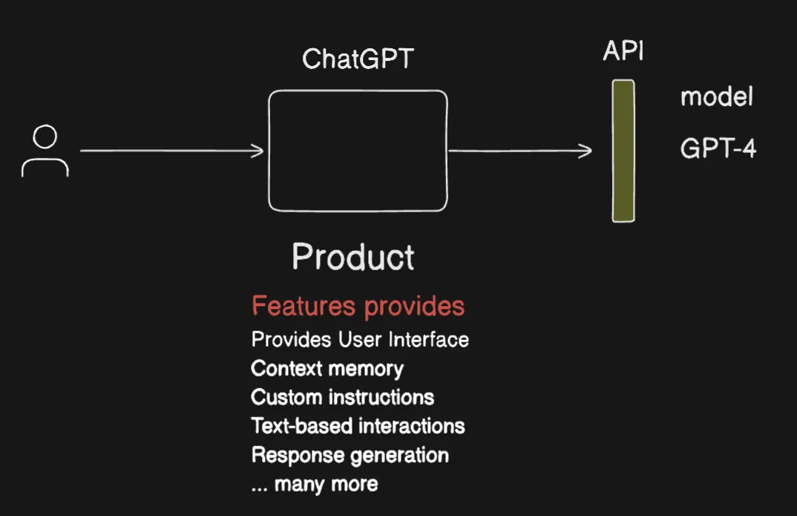
    
    ChatGPT helps track message history, which GPT-4 cannot do on its own as it’s a model.
    

---

### How LLM works ?

OpenAI chose an excellent name for their model. GPT does exactly what its name implies—generating text—just like any other large language model (LLM). In contrast, some other LLMs have names that might not be as intuitive; for example, names like "Claude" or "Gemini" could evoke associations unrelated to their function.

GPT (Generative Pre-Trained Transformer) 

- *Brief:* Transformer
    
    
    **Recurrent Neural Networks (RNNs)**, an important part of deep learning, led to the way for the development of Transformer models.
    
    When you read a sentence, you don't just focus on one word at a time; you understand the meaning of the whole sentence together.
    
    A Transformer works similarly: it looks at all the words at the same time and figures out how they relate to each other.
    

GPT is built using transformer architecture, which excels at capturing the context and relationships between words. This architecture is key to its ability to understand and generate text.

- **Training Phase:** During training, GPT is exposed to a vast amount of text data (e.g., books, websites). It learns language patterns, grammar, and context, effectively "learning" how language works.
- **Inference Phase:** When you type something into ChatGPT, the same transformer architecture processes your input. It uses the knowledge acquired during training to generate coherent and contextually relevant responses.

- *Why it’s called GPT ?*
    
    **Generative :** model can **generate text** — like writing answers, stories, or code.
    
    **Pre-Trained :** Before you use it, it has already been **trained on tons of text** (like books, websites) to learn how language works.
    
    **Transformer :** Because it’s a transformer
    

> ***Although ChatGPT can generate images, does that mean GPT-4 can generate images as well?*** Actually, GPT itself does not generate images. Instead, it collaborates with another model DALL-E (by OpenAI) that is specifically designed for image generation.
> 

> **GPT is a text prediction model, right? So how can it know real-time data like the current weather?** GPT alone cannot.
But when GPT is combined with tools, it becomes an Agent — and that's how it can fetch live data
> 
> - *What is a Agent and Practical Example*
>     
>     GPT Agent = GPT + Tools + Autonomy
>     
>     *Tools :* 
>     
>     - **Browser Tool** → to search the web
>     - **Code Interpreter** → to do math or file analysis
>     - **File Reader** → to read uploaded documents
>     
>     *Autonomy :* GPT **decides when to use a tool** based on your question, like a mini AI assistant.
>     
>     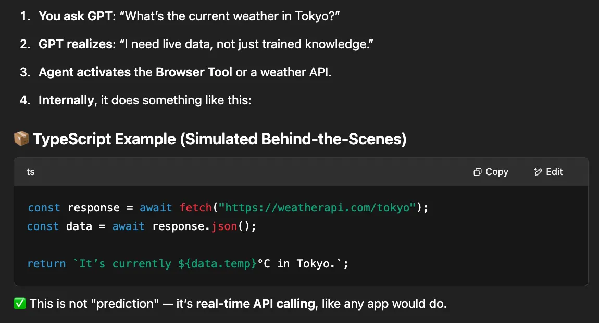
>     

---

[Google’s Transformer Architecture](https://arxiv.org/pdf/1706.03762)

### How Transformer works ?

- References
    
    
    Very Well Explanation : https://poloclub.github.io/transformer-explainer/
    
    - Every LLM is based on this architecture 😊
        
        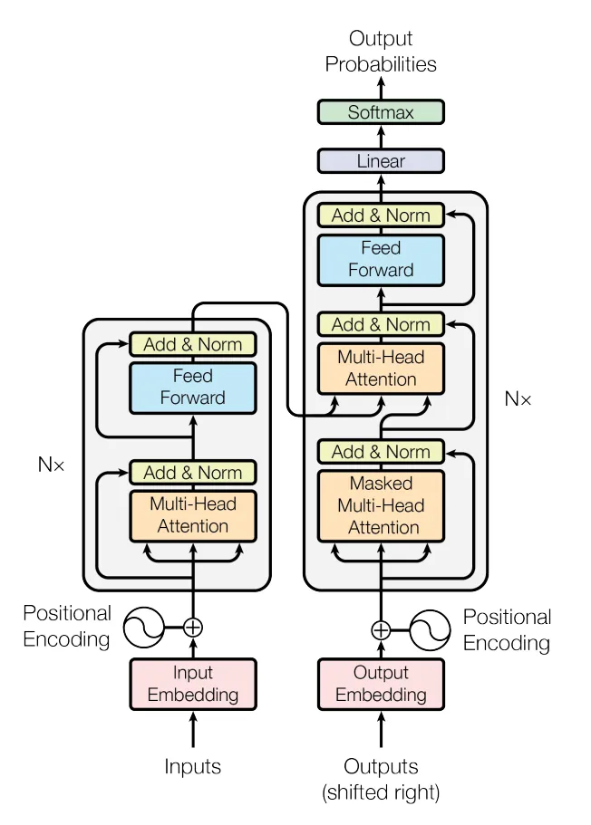
        
    
    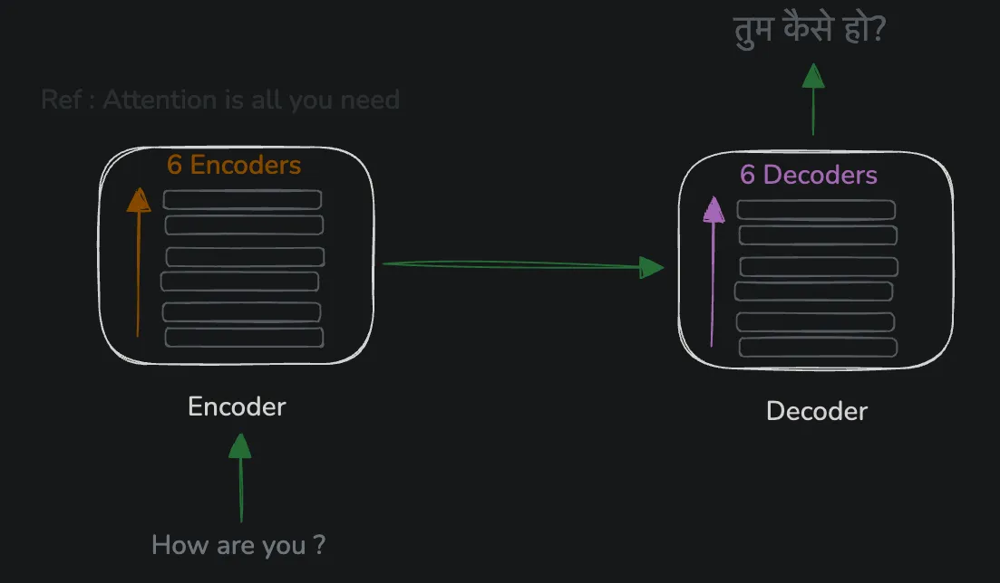
    
    6 encoders and 6 decoders is being used in the original research paper
    
    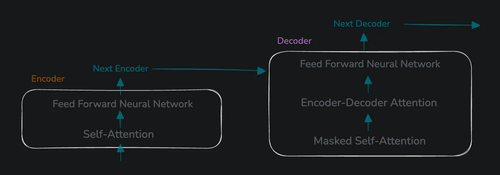
    
    - Each Encoder comprise of
        
        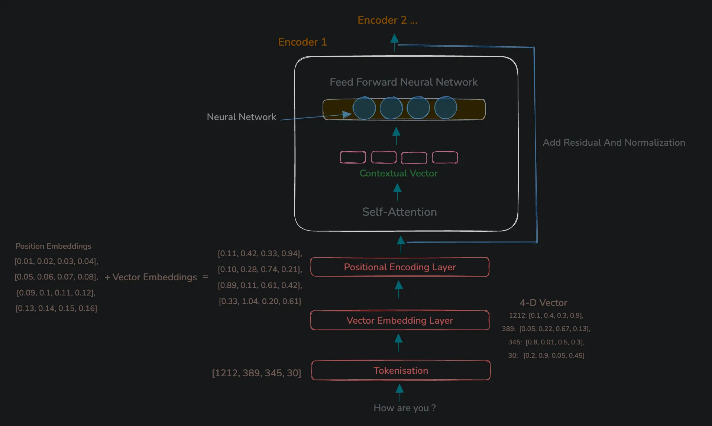
        
    - Each Decoder comprise of
        
        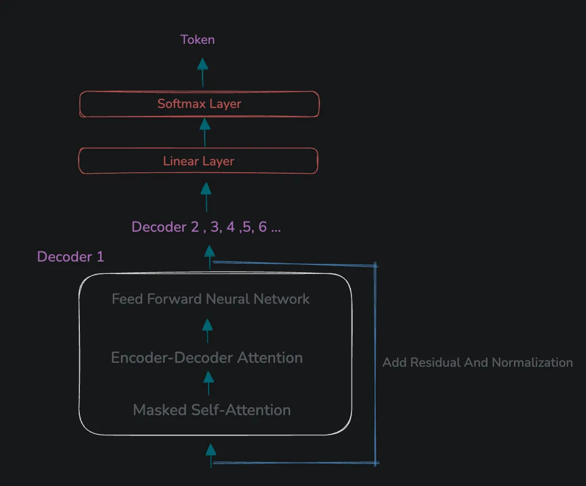
        

- *Step 1 : Tokenisation*
    
    **Splitting text into smaller chunks (called tokens) that the model can understand.**
    
    These tokens are *not* always full words — they can also be subwords, punctuation, or even spaces.
    
    ```
    ["I", " love", " learning", " new", " things", " every", " day", "."]
    ```
    
    The tokenization process varies from model to model.
    
    - Practical Visualization
        
        [https://tiktokenizer.vercel.app/?model={model-name}](https://tiktokenizer.vercel.app/?model=%7Bmodel-name%7D)
        
        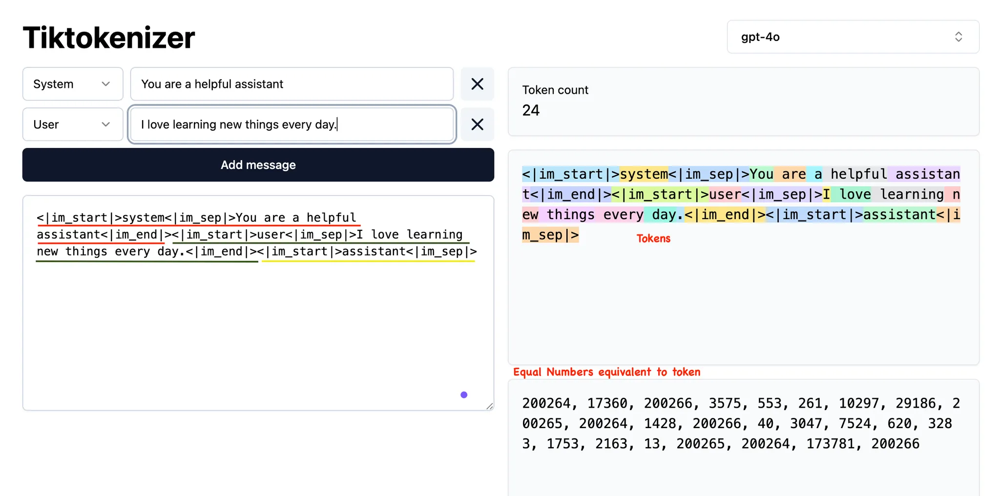
        
        > The tokens are color-highlighted, and you can see the numbers assigned to each one.
        > 
        
        ```
        <|im_start|>…<|im_sep|>…<|im_end|>
        ```
        
        - *Explanation of this Format*
            
            it's not written for humans to read—it’s a **special prompt format** used by GPT-4 to structure conversations. These special tokens tell the model exactly where messages start and end, and who is speaking.
            
            - **`<|im_start|>`**
                
                *Start of a message block.*
                
            - **`<|im_sep|>`**
                
                *Separator between role and message text.*
                
                It separates the speaker's role (like `system`, `user`, or `assistant`) from the actual message text.
                
            - **`<|im_end|>`**
                
                *End of a message block.*
                
        - *Why Are These Tokens Important?*
            
            They help GPT-4:
            
            - **Follow the Conversation:**
                
                They show where one person's message ends and another begins, so the model can understand the order of the conversation.
                
            - **Keep Track of Who Is Talking:**
                
                They label each message (like "Teacher" or "Student"), so the model knows who said what.
                
            - **Avoid Confusion Between Instructions and Questions:**
                
                They help the model remember previous messages so it doesn't mix up instructions and questions.
                
        
        ```sql
        System message:   "You are a helpful assistant"
        User message:     "I love learning new things every day."
        Assistant prompt: [GPT is expected to fill in this part]
        
        ```
        
        - The **system message** sets the rules: “You are a helpful assistant.”
        - The **user message** is the actual content: “I love learning new things every day.”
        - The **assistant prompt** is where GPT-4 will generate its reply.
        
    

- *Step 2: Convert Token into Vector Embeddings*
    
    
    **Vector embeddings are like a secret code that changes words, pictures, or sounds into numbers. These numbers help computers understand what they mean and how they are related.**
    
    > Each LLM gives different word vectors because:
    > 
    > - 🔤 **Different words or pieces**: Each model breaks text in its own way.
    > - 🧩 **Different split methods**: Some models split by word, some by parts of words.
    > - 📏 **Different vector sizes**: Some models use small vectors, others use big ones.
    > - 📚 **Different training**: Each model learns from different text.
    
    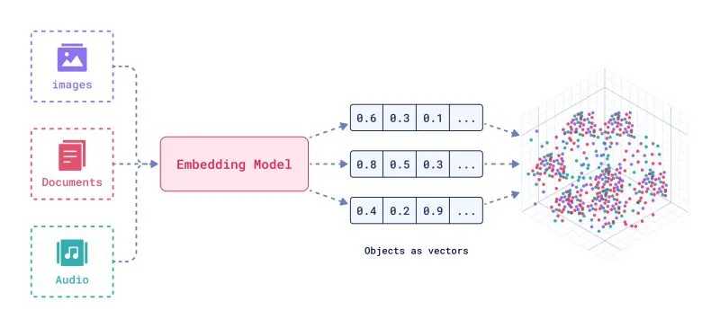
    
    *Docs*
    
    https://www.cs.cmu.edu/~dst/WordEmbeddingDemo/tutorial.html
    
    https://platform.openai.com/docs/guides/embeddings
    
    **→ Use the Embedding Matrix (Huge Lookup Table):**
    
    - The model has a giant table called an **embedding matrix**.
    - Every token has its own row in this table filled with a list of numbers.
    
    **→ Retrieve the Vector:**
    
    - When the model sees a token like **"love"**, it looks up its row in the embedding matrix.
    - It finds a list of numbers (called a **vector**) that represents the token.
    - **Example:** `"love" → [0.25, -0.71, 0.48, ..., 0.12]`
    
    **→ Understand the Vector's Dimensions:**
    
    - A **vector** is just a list of numbers that tells us something about a word.
    - The number of values in the list is called its **dimensionality**.
    - It’s like describing a superhero with many traits — not just 3 like height, width, and depth, but **50, 300, 768**, or more!
        
        ```sql
        const supermanVector = [0.75, 0.45, -0.80, 0.33, 0.92, -0.15];
        // [Strength, Speed, Intelligence, Flight Ability, Heroism, Kindness]
        // 0.75: Strong , 0.45: Fast , -0.80: Not the smartest 
        // 0.33: Can fly , 0.92: Very heroic , -0.15: not super kind
        ```
        
    
    > In real models, we don’t know what each number stands for. The model learns patterns on its own
    > 
    
    **→ Capture the Word's Meaning:**
    
    - These numbers are chosen so that tokens with similar meanings have similar vectors.
    - For instance, the vectors for **"love"** and **"like"** are close together in this space because they share similar meanings.
    
    **→ Use the Vector in the Model:**
    
    - The model uses these vectors to understand and process the text.
    - The vectors help the model determine the context and relationship between different tokens.

- *Step 3 : Positional Encoding*
    
    
    Transformers are **great at understanding word meanings**, but they **don’t know the order** of words by themselves.
    
    One unique thing about Transformers is that they don’t process tokens in a fixed order like a human reading left-to-right, and they have no built-in notion of sequence position (unlike RNNs that go step by step).
    
    > "Superman saves the city"
    > 
    
    After turning these words into **vectors (embeddings)**, the model has no idea what comes first or last. To the model, these vectors are just **floating in space** without any order. 
    
    So, if the model randomly grabs the words, you might get something weird like:
    
    > "City saves Superman the" 😅
    > 
    
    To fix this, we add **positional encoding** — a special set of numbers that tells the model **where** each word is in the sentence.
    
    `const supermanEmbedding = [0.75, 0.45, -0.80, 0.33, 0.92, -0.15];` - What the words means
    
    `const positionEncoding = [0.01, 0.05, 0.08, -0.02, 0.04, 0.03];` - Where the word is
    
    ```sql
    const encodedVector = supermanEmbedding.map((value, i) => value + positionEncoding[i]);
    console.log(encodedVector);
    // Result: [0.76, 0.50, -0.72, 0.31, 0.96, -0.12]
    // We can notice positions are also encoded in the above vector
    ```
    

🔁  Phase : Encoding ( repeats as many times as the number of encoder layers ) 

- *Step 4 : Pass Through Different Transform Layers*
    
    
    - A. Multi-Head Attention
        
        
        - *Prerequisites : RNN , Single-Head Attention*
            
            
            - *How RNN Works ?*
                
                
                RNNs process sequences **one token at a time** (left to right). Each token passes through a loop where it **remembers** some context from previous token.
                
                Problems:
                
                - Since RNNs go token by token, they **can't be parallelized**.
                - This makes training and inference very **slow**.
                - RNNs **struggle to remember** words that came much earlier.
                
                Practical Illustration:
                
                > "This is a river bank. This is an SBI bank."
                > 
                
                🧠 What does "bank" mean?
                
                - In the first sentence, "**bank**" refers to the **side of a river** 🌊
                - In the second sentence, "**bank**" refers to a **financial institution** 🏦
                
                🔍 Why RNNs Struggle Here
                
                - When the model reads "**bank**", it has access only to the **previous words**.
                - However, "**bank**" comes **at the end** of the sentence.
                - To understand its meaning, the model needs to **recall** earlier context like "**river**" or "**SBI**".
                - But RNNs tend to **forget** or **compress** information from earlier in the sequence — especially in longer sentences.
                
            
            - *How Single-Head Attention Works ?*
                
                
                > Instead of reading one word at a time and hoping to remember,**single-head attention** looks at the entire sentence at once and decides:
                
                *Which words are important for understanding the current word?*
                > 
                
                Practical Illustration:
                
                > "This is a river bank. This is an SBI bank."
                > 
                
                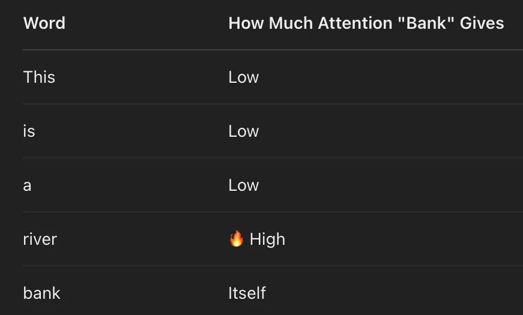
                
                The model focuses on "**river**" to understand "**bank**", learning it's a **riverbank**, not a financial bank.
                
                Problems:
                
                - It has **only one way** to process attention. It may get confused: is “bank” a **place** or a **river side**?
                    
                    
                    🧩 Needs multiple perspectives to separate financial vs. geographical meanings.
                    
                - It may focus just on **nearby words** like "is", "an", or "a" — which aren’t helpful and **might miss** key words like "river" or "SBI".
                    
                    
                    🧩Needs some heads to focus on **names** like "SBI", others on **locations** like "river".
                    
                - Since it uses one set of attention weights, it may **blur the context** of both “bank”s. It can accidentally combine info from "river bank" and "SBI bank".
                    
                    
                    🧩Multi-head allows **isolated focus** for each head → less confusion between meanings.
                    
                
            
        
        > Instead of using just one way to look at a sentence, multi-head attention looks at the same sentence in multiple different ways simultaneously.
        > 
        > 
        > Each attention head seeks to understand: **What different relationships within the sentence help me understand this word?**
        > 
        
        Practical Illustration:
        
        > "This is a river bank. This is an SBI bank."
        > 
        
        - Single-head has only one view — which leads to confusion between meanings.
        Multi-head attention gives **multiple specialized perspectives** at once.
            
            🧩 Now, **Head 1** can focus on geography, **Head 2** on named entities, **Head 3** on sentence grammar, etc.
            
        - Single-head might focus too much on nearby words like "is", "a", etc.
        Multi-heads distribute focus: some look **near**, some look **far** (e.g., “SBI”, “river”).
            
            
            🧩 This lets the model **catch meaningful context**, no matter where it appears in the sentence.
            
        - Single-head uses one set of weights → may **blur the meaning** between both instances of "bank".
        Multi-head keeps **contexts separate per head**, avoiding mix-ups.
            
            
            🧩 The model now **understands both “bank”s correctly**, without confusing one with the other.
            
        
        ---
        
    
    - *Contextual Vector*
        
        
        A **context vector** is a list of numbers (a vector) that represents the **meaning of a word** in its **current sentence** — based on attention.
        
        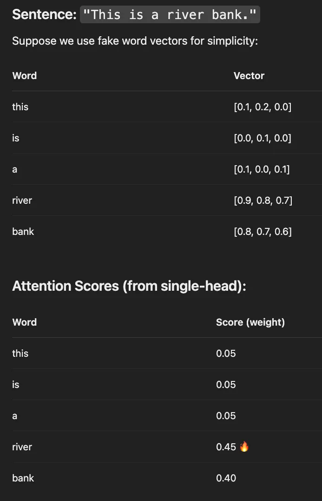
        
        ![`contextVector = [0.77, 0.67, 0.57];`](./images/contextual-vector-2.webp)
        
                                     `contextVector = [0.77, 0.67, 0.57];`
        
        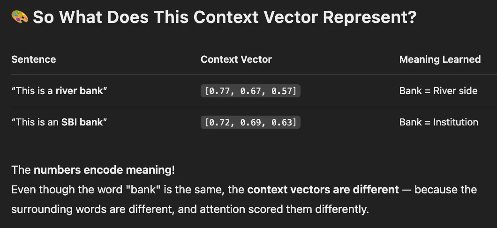
        
    
    <aside>
    
    The **Attention Layer** highlights important parts of the sentence (like "river" for "bank" and "SBI" for "bank") and return in **context vectors**. To interpret these representations more deeply (e.g., for classification, translation, or summarization), the **Feed Forward Layer** processes each word’s meaning **within its context**.
    
    </aside>
    
    - B.  Feed Forward Layer
        
        
        After attention gives each word a **context-aware representation**,
        the **Feed Forward Network (FFN)** → Neural Network , steps in to **deepen the understanding** by transforming that representation further.
        
        Practical Illustration:
        
        > "This is a river bank. This is an SBI bank."
        > 
        
        - Multi-head attention produces different **context vectors** for the word "**bank**":
            - In the first sentence, it focuses on "**river**"
            - In the second, it focuses on "**SBI**"
        
        Now, the **Feed Forward Layer** steps in and says:
        
        - "Let me process this **‘bank + river’** meaning and refine it."
        - "Let me process this **‘bank + SBI’** meaning and refine it."
        
        > 🧠 Even though both tokens are the same word — "**bank**" — they go through **separate transformations** because their **contexts are different**.
        > 
        
        - 🧩 Why It Matters ?
            - FFL gives each word a **final polish** before it moves through the Transformer block.
            - Without FFN (Feed Forward Network), the model has only a **shallow context understanding**.
            - FFN helps the model learn **non-linear**, **complex patterns** — essential for:
                - Classification
                - Translation
                - Summarization
                - Reasoning
        
    
    🔁 Repeat the Layers (Stacking)
    
    > A Transformer doesn’t stop at one layer. It stacks multiple layers of:
    → **Multi-head attention
    → Feed forward**
    Each layer **builds a deeper understanding**, like zooming in and refining knowledge.
    > 
    
    - Problem: What Happens When You Stack Many Layers?
        
        
        ⚠️ Problem 1: **Loss of Original Info**
        
        - As data moves through many layers, it can get **too transformed**.
        - The model **forgets the original meaning** of the word (the input).
        
        ⚠️ Problem 2: **Training Gets Unstable**
        
        - Deep networks are hard to train.
        - Sometimes the math behind training (gradients) can **explode** or **vanish**.
        - The model struggles to **learn properly**.
    
    ✅ Solution : Residual Connectoin + Normalization
    
    - C. Add Residual Connection + Normalization
        
        
        - 🧠 Simple Analogy:
            
            Imagine you're learning something new — like a math concept:
            
            - You learn it in **layers**: first from a **book**, then a **YouTube video**, then a **teacher**.
            - Each layer adds more depth, but it might also make things **more confusing**.
            
            Now think of how you can make this learning process smoother:
            
            - **Residual Connection**: You **keep the original textbook** with you, so you can always go back and check it if something becomes unclear.
            - **Normalization**: After each session, you **stay calm and organized** instead of letting all the new information pile up and overwhelm you.
        
        In Transformer Terms,
        
        - **Residual Connection**: Adds the original input back after the layer finishes processing. This prevents the model from forgetting the original information.
        - **Normalization**: Applied after adding the input back, it helps to:
            - **Stabilize** the values (so they don't become too large or too small)
            - **Speed up** and **stabilize** training (helps the model learn better)
    

🔁 Phase : Decoding ( repeats as many times as the number of decoder layers)

- *Step 5 : Pass Through Different Transform Layers*
    
    
    Auto-Regressive Prediction
    
    The decoder **predicts one word at a time** and feeds its own previous predictions back into the system.
    
    > 🧠 **Analogy**: Like writing a sentence one word at a time while checking the previous words you've written to decide the next one.
    > 
    
    - A. **Masked Self-Attention**
        
        
        Why Masked? → To **prevent cheating**. The model should not see future words while predicting the current one.
        
        Each word position in the output attends only to:
        
        - **Itself**
        - **All previous positions**
        
        > 🧠 Analogy: You’re writing an exam answer, but you can’t skip ahead in your textbook. You can only look at what you’ve written so far.
        > 
        
        - ‼ What if don’t mask it ?
            
            Transformers are trained and evaluated **auto-regressively** — they’re supposed to **predict one word at a time**, without knowing what comes next.
            
            If we allow future words to influence the current prediction, the model:
            
            - Doesn’t **learn true language generation**
            - Just copies or adapts what it already saw
            - Can’t be used in real generation tasks like:
                
                → Chatbots
                
                → Translation
                
                → Text completion
                
        
    
    - B. **Encoder-Decoder Attention**
        
        
        > 🧠 **Analogy**:
        Imagine you’re at a restaurant in Japan and you don’t speak Japanese
        A waiter comes up and says something in Japanese: **"オムライスを注文しますか？"** 
        You look at your translator friend (the encoder), who tells you:
        
        👉 "They're asking if you want to order omelette rice."
        Now, **you** (the decoder) need to reply in English:
        👉 "Yes Waiter!"
        > 
        > 
        > 🧩 Your **translator friend (encoder)** listens to the waiter and gives you the **meaning**.
        > 
        > 🗣️ **You (the decoder)** use that information to decide how to respond.
        > 
        > 💬 You then speak out the translated reply **one word at a time**, making sure it makes sense.
        > 
        
        ### 🔧 What Actually Happens in the Transformer :
        
        - The **decoder generates the output sequence one word at a time**.
        - While doing this, it continuously **references the encoder’s output**, which holds the understanding of the input sentence.
        - At each step, the decoder tries to:
            - **Use what it’s already said** (via masked self-attention)
            - **Understand what was originally said** (via encoder-decoder attention)
            - And decide **what to say next**
        
        > **Input** (Japanese): オムライスを注文しますか？
        > 
        > 
        > **Encoder understands**: "Do you want omelette rice?"
        > 
        > **Decoder understand this and replies** step-by-step:
        > 
        > 👉 "Yes" → “Waiter” → (done)
        > 
        
    
    - C. **Feed Forward Layer**
        
        
        > 🧠 **Analogy**:
        
        In the **Encoder-Decoder** setup, you’ve already understood the waiter’s question (thanks to the encoder) and figured out how to respond (with attention).
        
        Now, imagine you pause for a moment and think:
        
        “Hmm, instead of just saying 'Yes Waiter', maybe I should say 'Yes, please' — that sounds more polite and natural.”
        
        You already have the main idea (from attention), but now you’re **refining it**, **making it clearer**, and **choosing better words** so it sounds just right.
        > 
        
        After the attention steps, the model has a **basic understanding** of what each word means in context. Now it runs this **understanding** , through a **small neural network** — like giving the sentence to a mini brain that:
        
        - Makes the meaning **more precise**
        - Helps the model **spot patterns or refine ideas**
        - Improves how well each word fits with the others
        
        > This layer is applied to each word **independently**, but it helps sharpen what each word is *really trying to say*.
        > 
        > 
        > It’s used in **both encoder and decoder** — like a shared rule for polishing understanding.
        > 
    
     D. **Add Residual Connection + Normalization**  
    

- *Step 6 : Output Generation*
    
    
    > 🧠 Analogy:
    It’s like the model has a brainstorming session:
    > 
    > 
    > "Hmm, based on everything I know so far, the next word is probably **'Hello'** (80%), maybe **'Hi'** (15%), or **'Hey'** (5%)...
    > 
    > I’ll go with **'Hello'** since it’s the most confident choice.
    > 
    
    🔧 What Happens:
    
    1. The decoder's final vector for a word goes into a **linear layer**
        - This just transforms the vector into **raw scores** for each word in the vocabulary (e.g., "Hello", "World", "Apple", etc.)
    2. Then it passes through a **softmax function**:
        - This converts the scores into **probabilities** (between 0 and 1)
        - The highest probability = the most likely next word
    3. The word with the **highest probability** is chosen as the output for that step.
    

- *Step 7 : Repeat Process until the end token is generated*
    
    
    At this point, the model has **only guessed one word or one token** (the next word in the sequence).
    
    Each time it guesses a word, it:
    
    1. Adds it to the current sentence,
    2. Feeds it back in,
    3. Repeats the process **until the full sentence is complete** (signaled by the `<eos>` token).